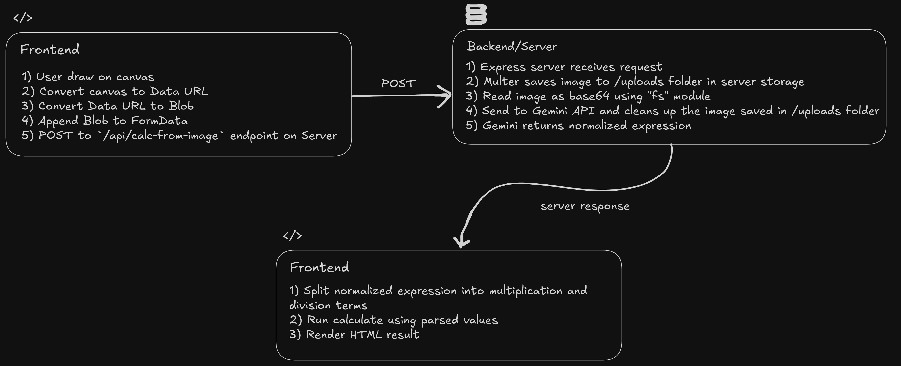

# LogSolve - Human-Style Log Solving, Automated

<p align="center">

</p>

## What is it? 🤔

LogSolve is a web app designed to simulate the manual process of solving mathematical expressions (e.g., 2 × 3²) using logarithm and antilogarithm tables—just like how humans traditionally solved them on paper.

## ✍️ How Humans Solve Using Log and Antilog Tables

Let’s solve a multiplication problem **manually** using **logarithm and antilogarithm tables**, exactly as done on paper.

---

#### 🔢 Example:

> Multiply **0.431 × 0.341**

---

#### 🪜 Step-by-Step Solution

##### 1. **Take logarithm of each number** (from log table):

| Number | Logarithm (from table) |
| ------ | ---------------------- |
| 0.431  | **$\bar{1}.6345$**     |
| 0.341  | **$\bar{1}.5328$**     |

---

##### 2. **Add the logarithms in bar format:**

$\bar{1}.6345$ + $\bar{1}.5328$ = $\bar{3}.1673$

---

##### 3. **Find the antilog of mantissa:**

- Look up antilog of **0.1673** in the antilog table:

  > **$\text{Antilog}(0.1673) \approx 1.470$**

- Characteristic is $\bar{1}$, so move decimal **1 places left**:

  > **$0.1470$**

---

##### ✅ Final Answer:

$$
0.431 \times 0.341 \approx \boxed{0.1470}
$$

---

### 🤖 Skip the Hassle with LogSolve

Now, what if I told you that you can skip all this manual work—finding characteristics, mantissas, checking values in log/antilog tables, and performing handwritten calculations? It’s too much work 😮‍💨

So here's a way to automate it and make everything much easier using LogSolve ✅:

<p align="center">


</p>

You just draw the equation, and you'll get a step-by-step solution—just like how a human would solve it 🤓 but without any log or antilog table!

## 🤳 Data Flow

<p align="center">



</p>

## 🧰 Tech Stack

#### 🖥️ Frontend

**Built with React 19 and modern UI tooling:**

- React + React DOM – Core UI library
- Vite – Fast development/build tool
- Tailwind CSS – Utility-first CSS framework
- React Router DOM (v7) – Client-side routing
- React Konva – Canvas drawing and freehand input
- Axios – HTTP requests
- React Icons – Icon library
- ESLint – Code linting and formatting

#### 🌐 Backend

**Developed with Node.js (ESM) and Express:**

- Express 5 – Web framework
- Multer – File uploads (for sketches)
- @google/genai – Gemini API integration
- CORS – Cross-origin request handling
- dotenv – Environment variable management
- form-data, mime, node-fetch – API integration helpers

#### 🧠 AI Model

- Model Used: Gemma 3 27B
- Provider: Accessed via the Google Gemini API using @google/genai
- Purpose: Processes drawn math expressions and returns human-style log/antilog-based step-by-step solutions

## 🗂️ Repository Structure

This monorepo links two submodules:

```
LogSolve/
├── frontend/     → React app (drawing interface + UI)
├── backend/      → Express server (Gemini API handler)
└── .gitmodules   → Contains submodule config
```

## 🚀 Getting Started

1. Clone the main repo and submodules

```bash
git clone --recurse-submodules https://github.com/Durubhuru14/LogSolve.git
cd LogSolve
```

2. Setup backend

```bash
cd backend
npm install
```

Now create a .env file in the root of the backend folder. To get the API key:

- Visit [Google Cloud Console](https://console.cloud.google.com) and create a project.
- Then go to [Google AI Studio](https://aistudio.google.com/) and generate your Gemini API key.

Add it to .env like so:

```env
API_KEY="YOUR_API_KEY"
```

Then run:

```bash
npm run dev
```

> Create a new terminal session and continue the setup for frontend (make sure you are in `LogSolve` folder)

3. Setup frontend

```bash
cd frontend
npm install
```

Now create a .env file in the root of the frontend folder and add your backend server URL:

```
VITE_SERVER_URL="https://your-backend-url.com/"
```

> Note: If you are running on server your own local machine and not on any external server (like render) then no need to do this.

**⚠️ Don't forget the trailing slash / at the end of the URL.**

Then run:

```bash
npm run dev
```

## 🐣 Author

**Durvesh More** (Online alias: **Durubhuru**)
🎓 Computer Science Undergrad (2027) | University of Mumbai

### 🌐 Connect With Me

📧 **Email**: [durveshmore.drm@gmail.com](mailto:durveshmore.drm@gmail.com)
🔗 **GitHub**: [Durubhuru14](https://github.com/Durubhuru14)
💼 **LinkedIn**: [Durvesh More](https://www.linkedin.com/in/durvesh-more-1016ab282)
📸 **Instagram**: [@durubhuru](https://www.instagram.com/durubhuru/)

---

Made with ❤️ by **Durubhuru**
